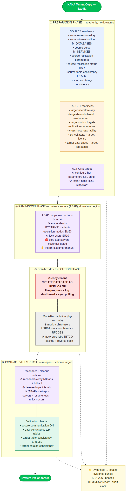

# SAP Migration Toolkit

<p>
  <a href="https://github.com/iamtiagomadeira/sap-migration-toolkit/actions/workflows/ci.yml"></a>
  <a href="https://github.com/iamtiagomadeira/sap-migration-toolkit/actions/workflows/codeql.yml"></a>
  
  
  <a href="LICENSE"></a>
  <a href="https://iamtiagomadeira.github.io/sap-migration-toolkit/"></a>
</p>

> _Codename: Exodia_ — a stateless, plugable command-line tool that automates the
> repetitive, error-prone parts of **SAP system migrations**: HANA tenant copy,
> backup/restore, HANA System Replication, and the ABAP cutover (ramp-down →
> downtime → post-activities).

Think **`ansible --check` meets a SAP Basis runbook**: Exodia validates
prerequisites, then executes migration steps with dry-run, explicit confirmation,
verification, documented rollback — and a sealed, tamper-evident audit trail for
every run. It runs on any Linux box, needs no database of its own, and never
phones home.

📖 **[Read the docs →](https://iamtiagomadeira.github.io/sap-migration-toolkit/)**

---

## Why

An SAP system copy today is largely manual: a consultant babysits `sapinst`
screens for hours, runs prerequisite checks by hand across a dozen transactions
and two SYSTEMDBs, and pastes screenshots into a handover document. It is slow,
inconsistent, and hard to audit.

Exodia turns that runbook into **repeatable, monitored, auditable automation**,
while keeping the human in control for the decisions that matter. It models a
real ECS/HEC cutover as first-class objects: read-only **checks**, guarded
**actions**, ordered **runbooks**, and sealed **evidence**.

## What's inside

| | |
|---|---|
| **91 checks** | read-only validations across HANA, ABAP (RFC), OS-level and landscape config |
| **25 actions** | guarded state changes: replica trigger, ramp-down, post-activities, HSR config |
| **7 runbooks** | ordered read-only sweeps with a single aggregate verdict |
| **4 cutover phases** | Preparation → Ramp-Down → Downtime → Post-Activities |

## Principles

- **Stateless** — runs and exits; no memory, no embedded planning database.
- **Two categories, one safety model:**
  - **Checks** are read-only. Safe to run anywhere, any time.
  - **Actions** change state. Guarded: pre-checks → dry-run (default) → explicit
    confirmation → execute → verify → documented rollback.
- **Safe by construction** — commands are argument lists, never `shell=True`;
  secrets are never logged or placed on a command line (HANA auth via the secure
  user store, `hdbsql -U <key>`); SSH uses host-key verification.
- **Plugable** — drop a module under `exodia/modules/` and it is auto-discovered
  in the menu, `list`, and runbooks. No central wiring.
- **Evidence by default** — every run seals a bundle with a SHA-256 manifest,
  an append-only event log, and a phased HTML/CSV report.
- **Defaults + escape hatch** — opinionated defaults for the 80% path, plus
  config/hooks for the 20%.

## Install

```bash
# from source (Python 3.11+):
git clone https://github.com/iamtiagomadeira/sap-migration-toolkit.git
cd sap-migration-toolkit
python3 -m venv .venv && .venv/bin/pip install -e .
```

## Quickstart

The easiest way in is the **interactive wizard** — no long commands, no YAML to
hand-craft. It discovers hdbuserstore keys for you and asks only the fields each
operation needs:

```bash
exodia menu        # guided, operator-friendly front door
```

Prefer direct commands? Everything is scriptable by name:

```bash
exodia list                 # every discovered check & action
exodia runbooks             # every readiness sweep
exodia cutover-plan         # the day-of playbook: 4 phases, exact commands, gates
exodia doctor               # self-check

# a read-only readiness sweep (safe, re-runnable):
exodia runbook tenant-copy.hana.readiness --config tenant-copy.yaml
```

Dry-run is the **default** for actions — pass `--execute --yes` to run for real.
Exit codes are automation-friendly: `0` = nothing blocking, `1` = a blocking
failure.

## The tenant-copy cutover, end to end

Exodia maps a HANA tenant copy onto the four cutover phases:



**Air-gapped by design.** Source (customer) and target (HEC) usually sit in
isolated networks. Capture one side into a **signed, tamper-evident snapshot**,
carry it across, and diff it against the other — the consultant's manual "read
here, compare there" loop, automated:

```bash
# in the customer network — capture a signed snapshot:
exodia snapshot tenant-copy.hana.readiness-source --side source --config source.yaml -o source.json

# carry source.json across, then in the HEC network — diff it live:
exodia compare source.json --against tenant-copy.hana.readiness-target --side target --config target.yaml
```

See the **[full coverage map](https://iamtiagomadeira.github.io/sap-migration-toolkit/tenant-copy-coverage/)**
for every check and action, phase by phase.

## Example: a guarded replica trigger

```bash
# 1. Readiness (read-only) — safe any time, changes nothing
exodia runbook tenant-copy.hana.readiness-target --config target.yaml
#   → phase-grouped table + one verdict; exit 1 if any blocker

# 2. Preview the copy (dry-run is the default — nothing runs)
exodia run tenant-copy.hana.copy-tenant --config target.yaml
#   [DRY-RUN] would run: CREATE DATABASE QAS AS REPLICA OF PRD AT '<src>:3<nn>13'

# 3. Execute for real — explicit opt-in, typed-name confirmation, live dashboard
exodia run tenant-copy.hana.copy-tenant --config target.yaml --execute --yes --monitor
#   → pre-checks → execute (progress bar + log tail) → verify → rollback on failure
```

## Supported scenarios

| Methodology | Databases | Coverage |
|---|---|---|
| **Tenant Copy** | HANA | cross-host (customer → HEC), replication or backup method, HSR/SSL config, mock-run isolation, post-copy consistency — **most complete** |
| **ABAP cutover (SAP MIG)** | any | pre-migration checks, ramp-down + post-activities actions, OS & landscape validation |
| Backup / Restore | HANA, SAP ASE | native tools + SWPM system copy |
| HANA System Replication | HANA | create / finalize / enable replica |
| Java (AS Java) system copy | HANA | SLD, SECSTORE, RFC, UME post-copy |

## Security & privacy

- No secrets on command lines or in logs — HANA auth goes through the secure
  user store (`hdbsql -U <key>`); SSH is key-based with host-key verification.
- Commands are always argument lists (`list[str]`) — **never** `shell=True`.
- Report security issues privately via
  [GitHub Security Advisories](https://github.com/iamtiagomadeira/sap-migration-toolkit/security/advisories/new)
  — see [SECURITY.md](SECURITY.md).

## Documentation

- **[Getting started & concepts](https://iamtiagomadeira.github.io/sap-migration-toolkit/)**
- **[HANA Tenant Copy — operator guide](https://iamtiagomadeira.github.io/sap-migration-toolkit/tenant-copy/)**
- **[Tenant Copy — full coverage](https://iamtiagomadeira.github.io/sap-migration-toolkit/tenant-copy-coverage/)**
- **[SAP MIG cutover](https://iamtiagomadeira.github.io/sap-migration-toolkit/cutover/)**
- **[Authoring a module](https://iamtiagomadeira.github.io/sap-migration-toolkit/authoring-a-module/)**

## Contributing

Contributions are welcome — new methodology modules, checks, and SAP Note
mappings especially. See [CONTRIBUTING.md](CONTRIBUTING.md).

> **Note on SAP Notes:** Exodia references SAP Note *numbers* for remediation and
> never reproduces their copyrighted text. SAP, HANA, and related marks are
> trademarks of SAP SE; this is an independent, unofficial open-source project.

## License

MIT © Tiago Madeira

## Star History

<a href="https://www.star-history.com/#iamtiagomadeira/sap-migration-toolkit&Date">
 <picture>
   <source media="(prefers-color-scheme: dark)" srcset="https://api.star-history.com/svg?repos=iamtiagomadeira/sap-migration-toolkit&type=Date&theme=dark" />
   <source media="(prefers-color-scheme: light)" srcset="https://api.star-history.com/svg?repos=iamtiagomadeira/sap-migration-toolkit&type=Date" />
   
 </picture>
</a>
